# FreelanceOS - AI-Powered Upwork Automation System

> Production System | Built: January 2025 | Timeline: 2 weeks | Role: Solo Developer

[](https://n8n.io) [](https://anthropic.com) [](https://clickup.com) [](https://telegram.org)

## 🎯 Overview

**The Problem:**
As a freelance developer on Upwork, I was spending 8-10 hours per week on repetitive tasks:
- Manually screening 30-40 job postings daily
- Writing custom proposals for each opportunity
- Preparing for interviews
- Managing project pipelines and time tracking

This created two major issues:
1. **Opportunity cost** - Time spent on admin work meant less time for billable client work
2. **Response time** - Manual processes resulted in 2-3 hour delays, causing me to lose opportunities to faster competitors

**The Solution:**
FreelanceOS is an end-to-end automation system that handles the complete freelance workflow from job discovery through project completion. Built using n8n workflow automation, Claude AI for proposal generation, and Telegram for mobile-first approvals, it transforms hours of manual work into minutes of strategic decision-making.

**The Impact:**
- ⏱️ **Time saved:** 8-10 hours/week → reinvested in billable work
- ⚡ **Response time:** 2-3 hours → 10 minutes (job alert to proposal ready)
- 📱 **Mobile-first:** 95% of operations performed from phone during fragmented work blocks
- 🎯 **Quality improvement:** AI-generated proposals with consistent high quality vs rushed manual writing

### 📊 Before vs After Comparison

| Metric | Before Automation | After Automation | Improvement |
|--------|------------------|------------------|-------------|
| **Job Screening** | 3-4 hours/week | 30 minutes/week | **87% reduction** |
| **Proposal Writing** | 30-45 min each | 60 seconds each | **98% reduction** |
| **Response Time** | 2-3 hours | 10 minutes | **12-18× faster** |
| **Mobile Operation** | 0% (desktop only) | 95% (phone) | **New capability** |
| **Proposal Quality** | Variable (fatigue) | Consistent (AI) | **Standardized** |
| **Weekly Admin Time** | 8-10 hours | 1-2 hours | **80% time savings** |
| **Monthly Value** | -$800 (lost time) | +$2,200 (saved time) | **$3,000 swing** |

---

## 🏗️ Architecture

```mermaid
graph TB
    subgraph "Input Sources"
        A[Email Job Alerts]
        B[Manual Telegram Trigger]
    end

    subgraph "Core Automation Engine"
        C[n8n Workflow Orchestration]
        D[PostgreSQL State Store]
    end

    subgraph "AI & Services"
        E[Claude API<br/>Proposal Generation]
        F[ClickUp<br/>Project Tracking]
        G[Toggl<br/>Time Tracking]
    end

    subgraph "Mobile Interface"
        H[Telegram Bot<br/>Approvals & Notifications]
    end

    A --> C
    B --> C
    C <--> D
    C <--> E
    C <--> F
    C <--> G
    C <--> H
    H --> User[📱 User Mobile]

    style A fill:#e1f5ff
    style B fill:#e1f5ff
    style C fill:#fff4e1
    style E fill:#f0e1ff
    style H fill:#e1ffe1
    style User fill:#ffe1e1
```



**Key Components:**

- **n8n Workflow Engine:** Orchestrates all automation, handles webhook routing, manages state persistence
- **Claude API (Sonnet 4.5):** Generates customized proposals, interview prep materials, and project retrospectives
- **Telegram Bot:** Mobile-first interface for approvals, notifications, and quick commands
- **ClickUp API:** Automated project management, task tracking, milestone management
- **Email Parser:** Converts Upwork job alerts into structured data (due to Upwork RSS/API restrictions)

**Data Flow:**
1. Job alerts arrive via email → n8n parses and scores based on criteria
2. High-scoring jobs trigger Claude API for proposal generation
3. Proposal sent to Telegram for mobile approval
4. Approved proposals logged in ClickUp for pipeline tracking
5. Project lifecycle managed through automated workflows

---

## 🛠️ Tech Stack

| Category | Technology | Why Chosen |
|----------|-----------|------------|
| **Workflow Engine** | n8n | Open-source, visual workflow builder, extensive integrations, self-hostable for data privacy |
| **AI Engine** | Claude API (Sonnet 4.5) | Superior writing quality for proposals, 200K context window, precise instruction following |
| **Project Management** | ClickUp | Robust API, flexible structure, mobile app, unlimited plan at $9/month |
| **Mobile Interface** | Telegram Bot | Universal platform, rich bot API, instant delivery, no custom app development needed |
| **Time Tracking** | Toggl | Simple API, widely used, Upwork integration available |
| **Database** | PostgreSQL | n8n workflow state, job history, performance metrics |
| **Infrastructure** | Docker + DigitalOcean VPS | Reproducible deployments, 4GB RAM server ($40/month), complete control |

**Cost Analysis:**
- Monthly operating cost: ~$67 (server $40 + Claude API $15 + ClickUp $9 + misc $3)
- Break-even: Less than 1 project/month (avg project value $2,000)
- ROI: Time saved alone worth $800-1,000/month at $100/hr rate

---

## 💡 Key Technical Decisions

### Challenge 1: Telegram's Single Webhook Limitation

**Problem:**
Telegram bots can only register ONE webhook URL globally. I needed to handle multiple workflow types (approvals, commands, notifications) but couldn't create separate webhooks per workflow.

**Options Considered:**
- **Option A:** Polling instead of webhooks → High latency, inefficient
- **Option B:** Single webhook + external router → Additional complexity/infrastructure
- **Option C:** Master router workflow in n8n → Single point of routing

**Solution Chosen:** Master router workflow with cascading IF nodes

**Why:**
- Keeps all logic within n8n (no additional services)
- Uses n8n's built-in conditional routing
- Easy to debug and maintain visually
- Zero additional infrastructure cost

**Result:** Single webhook routes to 12+ different workflow types with <100ms routing overhead

**Technical Pattern (Conceptual):**
```javascript
// Telegram webhook receives update
// Master router examines:
// - update.message.text (for commands like /approve)
// - update.callback_query.data (for inline button presses)
// - update type (message, callback, etc.)
// Routes to appropriate sub-workflow via webhook trigger
```

---

### Challenge 2: State Management in Stateless Workflows

**Problem:**
n8n workflows are stateless by default. I needed to maintain context across multiple executions:
- Track which proposals are pending approval
- Remember job scoring results between workflow runs
- Maintain conversation state for multi-step Telegram interactions

**Options Considered:**
- **Option A:** External Redis cache → Additional infrastructure, complexity
- **Option B:** Database queries every time → High latency, inefficient
- **Option C:** n8n's `workflow.staticData` → Built-in persistence

**Solution Chosen:** `workflow.staticData` with PostgreSQL fallback

**Why:**
- Built into n8n, no additional services
- Persists across workflow executions
- Fast in-memory access
- PostgreSQL for long-term historical data

**Result:** Sub-second state retrieval, zero infrastructure additions

---

### Challenge 3: Mobile-First Workflow Design

**Problem:**
As a homeschool parent, my work happens in fragmented 10-15 minute blocks throughout the day. Desktop-based approval systems don't work for this schedule.

**Options Considered:**
- **Option A:** Email-based approvals → Slow, cluttered inbox
- **Option B:** Custom mobile app → Expensive, time-consuming to build
- **Option C:** Telegram bot → Universal, instant, no app needed

**Solution Chosen:** Telegram bot with inline keyboards

**Why:**
- Available on all devices (phone, tablet, desktop)
- Push notifications for instant awareness
- Inline keyboards for one-tap approvals
- Rich formatting (markdown, buttons, links)
- Zero app development effort

**Result:** 95% of system operations (screening, approvals, tracking) performed entirely from mobile device

---

### Challenge 4: Job Discovery Without Official API

**Problem:**
Upwork doesn't provide official RSS feeds or job discovery API. Previous workarounds:
- Vollna service (defunct)
- RSS feeds (blocked by anti-bot detection)
- Web scraping (violates ToS, easily detected)

**Options Considered:**
- **Option A:** Browser automation (Puppeteer) → Violates ToS, account suspension risk
- **Option B:** Third-party aggregators → Limited data, additional cost
- **Option C:** Email parsing + manual triggers → Compliant, reliable

**Solution Chosen:** Hybrid email parsing + Telegram manual trigger

**Why:**
- Upwork's email alerts are official and reliable
- Email parsing via IMAP is completely ToS-compliant
- Manual trigger allows instant processing of high-priority jobs found while browsing
- Zero account suspension risk

**Implementation:**
1. Configure Upwork job alerts → dedicated email address
2. n8n Email Trigger monitors inbox via IMAP every 5 minutes
3. Parse email to extract job details and URL
4. Fetch full job page for additional context
5. Telegram `/submit_job <url>` command for manual high-priority jobs

**Result:** Real-time job discovery (1-2 minute email lag) with 100% ToS compliance

---

## 📊 Results & Impact

### Performance Metrics
- ⚡ **Job screening time:** 5-10 min/job → 30 seconds automated
- 📝 **Proposal generation:** 30-45 minutes → 60 seconds (AI-assisted)
- 📱 **Mobile operation:** 95% of approvals from phone during child care
- ⏱️ **Response time:** Job posted → proposal ready in ~10 minutes

### Time Savings
- **Weekly time saved:** 8-10 hours
- **Reinvestment:** Billable client work at $100-250/hour
- **Monthly value:** $3,200-10,000 in reclaimed capacity
- **ROI:** System pays for itself with < 1 hour/month of saved time

### Business Impact
- **Faster response time:** Early bird advantage on new postings
- **Consistent quality:** AI-generated proposals never fatigued/rushed
- **Better work-life balance:** Automation runs 24/7, human only reviews
- **Scalability:** Can process 50+ jobs/day vs 10-15 manually

### System Reliability
- **Uptime:** 99.5% (DigitalOcean VPS)
- **Error rate:** <1% (mostly external API timeouts)
- **Processing capacity:** Handles 40-50 jobs/day with zero degradation

---

## 🔍 Code Examples & Patterns

This repository contains **conceptual examples and pseudocode** to demonstrate architectural thinking. Full implementation contains proprietary business logic.

### Pattern 1: Scoring Algorithm (8-Stage Matrix)
See: [`examples/scoring-algorithm.md`](examples/scoring-algorithm.md)

**Concept:** Multi-factor scoring system evaluates job opportunities across 8 dimensions (budget, client history, skills match, red flags, etc.). High-scoring jobs (≥70/100) proceed to proposal generation.

### Pattern 2: State Management in n8n
See: [`examples/state-management.js`](examples/state-management.js)

**Concept:** Using `workflow.staticData` for cross-execution persistence without external dependencies.

### Pattern 3: Telegram Webhook Router
See: [`examples/webhook-router.md`](examples/webhook-router.md)

**Concept:** Single webhook endpoint routes to multiple workflow types using pattern matching.

### Pattern 4: Error Handling & Graceful Degradation
See: [`examples/error-handling.js`](examples/error-handling.js)

**Concept:** Fail-safe design where service failures trigger Telegram alerts rather than blocking workflows.

---

## 📚 Documentation

- **[Architecture Overview](docs/architecture.md)** - Detailed system design, components, and data flow
- **[Technical Decisions](docs/technical-decisions.md)** - Deep dive into technology choices and trade-offs
- **[Case Study](docs/case-study.md)** - Full problem → solution → results narrative
- **[Challenges Solved](docs/challenges.md)** - Technical obstacles and solutions

---

## 🎓 Skills Demonstrated

**Technical Skills:**
- **Workflow Automation:** n8n visual programming, webhook management, state handling
- **AI Integration:** Claude API prompt engineering, context management, quality control
- **API Integration:** RESTful APIs (ClickUp, Toggl, Telegram), webhook handling, rate limiting
- **Mobile-First Design:** Telegram bot development, inline keyboards, push notifications
- **DevOps:** Docker containerization, PostgreSQL administration, VPS management, backup strategies

**Architecture Patterns:**
- **Event-Driven Architecture:** Webhook-based triggering, asynchronous processing
- **State Management:** Persistence strategies in stateless systems
- **Fail-Safe Design:** Error handling, retry logic, graceful degradation
- **Mobile-First UX:** Approval workflows optimized for phone interaction

**Problem-Solving:**
- Working around platform limitations (Telegram single webhook)
- ToS-compliant solutions (email parsing vs scraping)
- Optimization for fragmented work schedules (mobile-first)
- Cost-effective architecture (minimal infrastructure)

---

## ⚠️ Note on Code Availability

This portfolio piece showcases **architectural thinking and problem-solving approach**. The full implementation contains proprietary business logic and is not publicly available.

**What's included in this repository:**
- ✅ Architecture diagrams and system design
- ✅ Technical decision rationale and trade-off analysis
- ✅ Code patterns and examples (pseudocode/conceptual)
- ✅ Results and measurable impact
- ✅ Challenges solved and approaches taken

**What's not included:**
- ❌ Complete n8n workflow JSON files (competitive advantage)
- ❌ Actual Claude API prompts (refined through iteration)
- ❌ Proprietary scoring algorithms and weights
- ❌ ClickUp custom field schemas and screening criteria
- ❌ Production configurations and API credentials

**Why this approach?**

This system represents significant competitive advantage in the freelance marketplace. The specific scoring criteria, prompt engineering, and workflow orchestration are the result of extensive testing and refinement. Sharing these would eliminate the advantage while the high-level architecture demonstrates technical capability.

---

## 🚀 Technical Highlights

**What makes this system notable:**

1. **Zero Custom Code:** Entire system built with low-code tools (n8n) + AI API, demonstrating effective tool selection over reinventing wheels

2. **Mobile-First Philosophy:** 95% mobile operation proves automation can work for non-desk workflows (important for parents, digital nomads, etc.)

3. **Telegram Single Webhook Solution:** Novel approach to Telegram's webhook limitation using master router pattern

4. **ToS Compliance:** Email parsing approach respects platform rules while achieving automation goals

5. **Cost-Effectiveness:** $67/month operating cost with multi-thousand dollar monthly ROI

6. **AI Prompt Engineering:** Claude prompts refined to generate high-quality, personalized proposals (not generic templates)

---

## 💼 Project Context

**Timeline:** 2 weeks (initial build) + ongoing refinements
**Role:** Solo developer - architecture, implementation, deployment
**Status:** Production system running since January 2025
**Scale:** Processing 30-40 jobs/day, managing 5-10 concurrent projects

**Technologies Mastered:**
- n8n workflow automation
- Claude API integration
- Telegram bot development
- PostgreSQL database design
- Docker deployment
- Email parsing (IMAP)
- Webhook security

---

## 📧 Contact

**Interested in discussing this project or similar automation challenges?**

📧 **Email:** cbosman@praxisprotocol.io
💼 **LinkedIn:** [linkedin.com/in/csbosman](https://www.linkedin.com/in/csbosman/)
🐙 **GitHub:** [github.com/bozzdev](https://github.com/bozzdev)

This project demonstrates capabilities in:
- Workflow automation and system integration
- AI/LLM integration and prompt engineering
- Mobile-first architecture design
- API development and integration
- DevOps and production deployment

Available for consulting on similar automation projects, AI integration, or technical architecture.

---

## 📄 License

**Documentation:** MIT License
**Code Examples:** MIT License (pseudocode/concepts only)

*Portfolio piece created February 2025. Project built January 2025.*

---

**Note:** This is a portfolio demonstration. For full details on implementation approach, technical deep-dives, or to discuss similar projects, please reach out directly.
