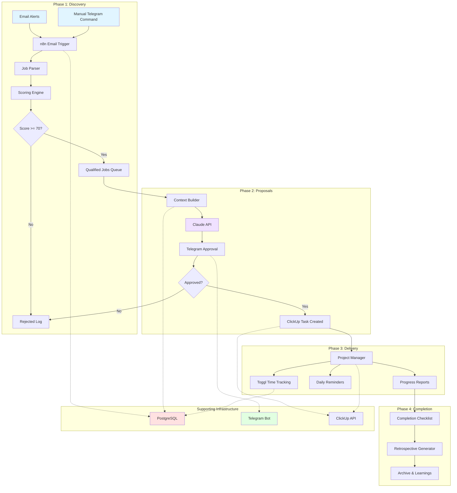
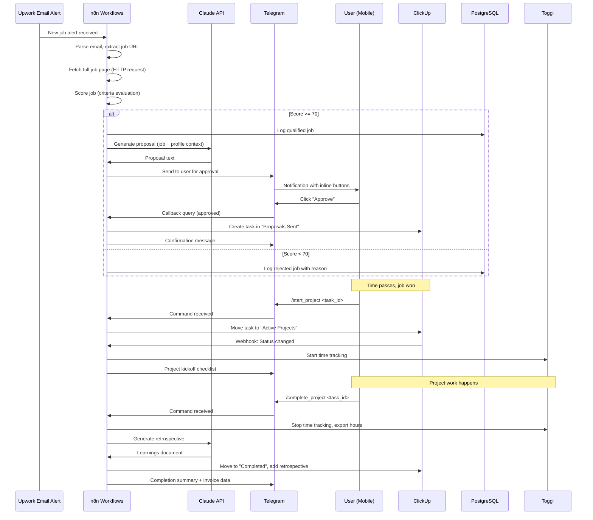

# System Architecture - FreelanceOS

## Table of Contents
- [High-Level Overview](#high-level-overview)
- [Core Components](#core-components)
- [Data Flow](#data-flow)
- [Integration Architecture](#integration-architecture)
- [State Management](#state-management)
- [Deployment Architecture](#deployment-architecture)
- [Security & Reliability](#security--reliability)

---

## High-Level Overview

FreelanceOS follows an **event-driven, microservices-style architecture** orchestrated through n8n workflows. Each phase of the freelance lifecycle (discovery, proposals, interviews, delivery, completion) operates as an independent workflow with clear input/output contracts.

### Architecture Diagram



### Design Principles

1. **Modularity:** Each phase operates independently with well-defined interfaces
2. **Fail-Safe:** Every workflow has error handling and fallback to human notification
3. **Mobile-First:** All human interactions optimized for Telegram mobile interface
4. **Stateless Workflows:** Workflows are stateless by default; state stored in PostgreSQL or staticData
5. **Audit Trail:** All decisions logged for analytics and debugging

---

## Core Components

### 1. Workflow Orchestration Engine (n8n)

**Purpose:** Central nervous system of FreelanceOS. Orchestrates all automation workflows.

**Key Responsibilities:**
- Trigger workflows based on events (emails, webhooks, schedules)
- Route data between services (Claude, ClickUp, Telegram, Toggl)
- Manage workflow state using staticData
- Handle errors with retry logic and notifications
- Execute scheduled tasks (daily reminders, weekly reports)

**Architecture Pattern:** Event-driven microservices
- Each workflow is a separate "microservice"
- Workflows communicate via webhooks or database
- Master router pattern for Telegram single webhook

**State Management:**
- `workflow.staticData` for cross-execution persistence
- PostgreSQL for long-term historical data
- Redis (optional) for caching API responses

**Why n8n over alternatives:**
- Visual workflow builder (easier to debug than code)
- 400+ pre-built integrations
- Self-hostable (data privacy + cost control)
- Active community and regular updates
- Webhook-based triggers (real-time)

---

### 2. AI Engine (Claude API - Sonnet 4.5)

**Purpose:** Generate high-quality, contextual written content (proposals, interview prep, retrospectives).

**Use Cases:**
1. **Proposal Generation:**
   - Input: Job posting, freelancer profile, past successful proposals
   - Output: Customized 200-400 word proposal
   - Model: claude-sonnet-4-5 (quality over speed)

2. **Interview Preparation:**
   - Input: Job posting, submitted proposal, client background
   - Output: Expected questions, suggested answers, negotiation strategy
   - Model: claude-sonnet-4-5

3. **Project Retrospectives:**
   - Input: ClickUp completed tasks, Toggl time logs, project notes
   - Output: What went well, what to improve, lessons learned
   - Model: claude-sonnet-4-5

**Integration Pattern:**
```
n8n HTTP Request Node
  ├─ POST https://api.anthropic.com/v1/messages
  ├─ Headers: x-api-key, anthropic-version
  ├─ Body: { model, max_tokens, messages }
  └─ Response: content[0].text → Parsed output
```

**Error Handling:**
- 429 (rate limit): Exponential backoff retry (1s, 2s, 4s)
- 500 (server error): Retry 3x, then Telegram alert
- Timeout: 30-second limit, fallback to human notification

**Why Claude over alternatives:**
- Superior writing quality (more human, less formulaic)
- 200K context window (can include full job posting + profile)
- Excellent instruction following
- Consistent tone and style

---

### 3. Mobile Interface (Telegram Bot)

**Purpose:** Primary human interface for approvals, notifications, and quick commands.

**Core Features:**

**Inbound (User → System):**
- `/submit_job <url>` - Manual job submission
- `/approve <task_id>` - Approve proposal
- `/reject <task_id>` - Reject proposal
- `/status` - Show active jobs
- `/interview <task_id>` - Generate interview prep
- Inline button callbacks for one-tap actions

**Outbound (System → User):**
- Proposal approval requests with inline keyboards
- Daily standup reminders
- Time tracking alerts
- Project milestone notifications
- Error/failure alerts

**Technical Architecture:**
```
Telegram Servers
      ↓
Single Webhook URL (https://domain.com/webhook/telegram)
      ↓
Master Router Workflow (n8n)
      ↓
   Pattern Matching:
   ├─ /submit_job → Job Discovery Workflow
   ├─ /approve → Proposal Approval Workflow
   ├─ /status → Status Query Workflow
   ├─ callback_query → Button Handler Workflow
   └─ Default → Help Message
```

**Single Webhook Solution:**
- **Challenge:** Telegram allows only ONE webhook per bot
- **Solution:** Master router workflow with cascading IF nodes
- **Implementation:** Pattern matching on message.text and callback_query.data
- **Performance:** <100ms routing overhead

**Message Formatting:**
- Markdown for emphasis and structure
- Inline keyboards for interactive buttons
- Code blocks for technical details
- Emojis for visual hierarchy

**Why Telegram:**
- Universal (phone, tablet, desktop, web)
- Push notifications (instant awareness)
- Rich formatting and inline keyboards
- No custom app development needed
- Free (bot API has no per-message cost)

---

### 4. Project Management (ClickUp)

**Purpose:** Centralized project tracking, task management, and pipeline visibility.

**Data Model:**
```
Workspace: FreelanceOS
  └─ Space: Upwork Pipeline
      ├─ List: Prospects (scored jobs)
      ├─ List: Proposals Sent
      ├─ List: Active Projects
      └─ List: Completed/Archive
```

**Custom Fields:**
- Job URL (link to Upwork posting)
- Budget ($)
- Client name
- Proposal submitted date
- Interview scheduled (date)
- Project deadline
- Score (0-100)

**Statuses:**
- Prospects: New → Qualified → Proposal Drafted → Sent
- Active: In Progress → Review → Complete

**API Operations:**
1. **Create Task:** When proposal approved
2. **Update Status:** As job progresses through pipeline
3. **Add Comments:** Log proposal text, client responses, notes
4. **Get Tasks:** Daily digest of active work

**Automation Triggers:**
- Task moves to "Active Projects" → Start Toggl timer
- Task completed → Stop timer, generate invoice data
- Task overdue → Telegram alert

**Why ClickUp:**
- Robust API (RESTful, well-documented)
- Flexible custom fields (adapt to freelance workflow)
- Mobile app (view on-the-go)
- Affordable ($9/month unlimited plan)
- Webhooks for bidirectional sync

---

### 5. Time Tracking (Toggl)

**Purpose:** Automatic time tracking per project for invoicing and profitability analysis.

**Integration Pattern:**
```
ClickUp Task Status Change
      ↓
n8n Webhook Listener
      ↓
   IF status = "In Progress"
      ↓
   Toggl API: Start Time Entry
      ├─ Description: ClickUp Task #{id}
      ├─ Project: Mapped from ClickUp
      └─ Tags: [Client name, Task type]

   IF status = "Complete"
      ↓
   Toggl API: Stop Time Entry
      ↓
   Export time summary → Invoice data
```

**Automation Rules:**
- Auto-start timer when task moves to "In Progress"
- Auto-stop when task moves to "Review" or "Complete"
- Reminder if no time entry > 4 hours during work day
- Weekly time summary sent to Telegram

**Data Extracted:**
- Total hours per project
- Hourly breakdown by task
- Effective hourly rate (project revenue / hours)
- Time by category (development, meetings, admin)

**Why Toggl:**
- Simple, reliable API
- Upwork integration available
- Reports for invoicing
- Free tier sufficient for solo use

---

## Data Flow

### End-to-End: Job Discovery → Project Completion



### Data Transformation Stages

**Stage 1: Email → Structured Job Data**
```
Input: Raw Upwork email HTML
  ↓
Extract: Job title, URL, budget (regex/parsing)
  ↓
Fetch: Full job page via HTTP request
  ↓
Parse: Description, skills, client info (Cheerio/HTML parsing)
  ↓
Output: Structured JSON job object
```

**Stage 2: Job Data → Proposal**
```
Input: Job object + Freelancer profile
  ↓
Build Context: Combine job requirements + relevant experience
  ↓
Claude Prompt: "Generate proposal addressing [key points]"
  ↓
AI Generation: 200-400 word customized proposal
  ↓
Output: Proposal text + metadata
```

**Stage 3: Proposal → ClickUp Task**
```
Input: Approved proposal + job metadata
  ↓
API Call: ClickUp create task
  ├─ Title: Job title
  ├─ Description: Proposal text
  ├─ Custom fields: Budget, URL, score
  └─ Status: "Proposals Sent"
  ↓
Output: ClickUp task ID for tracking
```

---

## Integration Architecture

### API Integration Patterns

**Pattern 1: Webhook-Based (Real-Time)**
```
External Service (Telegram, ClickUp)
      ↓
HTTPS POST to n8n webhook URL
      ↓
n8n Webhook Trigger Node
      ↓
Workflow execution begins
```

**Pattern 2: Polling-Based (Scheduled)**
```
n8n Cron Trigger (every 5 minutes)
      ↓
HTTP Request to external API
      ↓
Check for new items
      ↓
Process new items only (de-duplication)
```

**Pattern 3: Request-Response (On-Demand)**
```
Workflow needs external data
      ↓
n8n HTTP Request Node
      ├─ Method: GET/POST
      ├─ Auth: Bearer token / API key
      └─ Error handling: Retry logic
      ↓
Parse response
      ↓
Continue workflow with data
```

### Authentication Management

**API Keys Storage:**
- Environment variables (`.env` file)
- n8n credentials manager (encrypted)
- Never hardcoded in workflows

**Rotation Strategy:**
- Quarterly key rotation
- Immediate rotation if exposure suspected
- Separate keys for dev/prod environments

---

## State Management

### Challenge: Stateless Workflows

n8n workflows are **stateless by default**. Each execution is independent. This creates challenges for:
- Tracking which proposals are pending approval
- Remembering job scoring results between runs
- Maintaining conversation state for multi-step interactions

### Solution: Multi-Tiered State Strategy

**Tier 1: workflow.staticData (In-Memory Persistence)**
```javascript
// Built-in n8n feature for cross-execution state
const staticData = workflow.staticData;

// Store pending approvals
staticData.pendingApprovals = staticData.pendingApprovals || {};
staticData.pendingApprovals[jobId] = {
  proposalText: proposal,
  timestamp: Date.now(),
  score: jobScore
};

// Retrieve later in different execution
const pending = staticData.pendingApprovals[jobId];
```

**Use Cases:**
- Pending approval tracking (short-term)
- Temporary caches (< 1 hour)
- Workflow execution counters
- Last execution timestamps

**Limitations:**
- Cleared on workflow deactivation/restart
- Single workflow scope (not shared across workflows)
- Not suitable for long-term storage

---

**Tier 2: PostgreSQL (Long-Term Persistence)**
```sql
-- Jobs table
CREATE TABLE jobs (
  id UUID PRIMARY KEY,
  upwork_job_id VARCHAR,
  title TEXT,
  description TEXT,
  budget DECIMAL,
  score INTEGER,
  status VARCHAR,
  created_at TIMESTAMP
);

-- Proposals table
CREATE TABLE proposals (
  id UUID PRIMARY KEY,
  job_id UUID REFERENCES jobs(id),
  content TEXT,
  status VARCHAR, -- draft, approved, sent, rejected
  approved_at TIMESTAMP,
  clickup_task_id VARCHAR
);
```

**Use Cases:**
- Historical job data (analytics)
- Proposal archive
- Performance metrics
- Audit trail

**Access Pattern:**
```
n8n Postgres Node
  ├─ INSERT: Store new job
  ├─ UPDATE: Change proposal status
  ├─ SELECT: Retrieve historical data
  └─ Complex queries: Analytics/reporting
```

---

**Tier 3: ClickUp (Business State)**

ClickUp serves as the "single source of truth" for pipeline state:
- Current status of each opportunity
- Project timelines and deadlines
- Task dependencies
- Team collaboration notes

**Why ClickUp for state:**
- Visual dashboard (human-readable)
- Mobile access (check status anywhere)
- Audit trail (change history)
- External integrations (share with clients)

---

## Deployment Architecture

### Infrastructure

**Production Environment:**
```
DigitalOcean Droplet (Ubuntu 22.04 LTS)
├─ 4 vCPU
├─ 8GB RAM
├─ 100GB SSD
└─ Cost: $40/month

Docker Compose Stack:
├─ n8n (primary application)
├─ PostgreSQL 14 (workflow state)
├─ Redis (optional caching layer)
└─ Nginx (reverse proxy + SSL termination)
```

**Service Layout:**
```
Internet
   ↓
Cloudflare (CDN + DDoS protection)
   ↓
Nginx (SSL termination, reverse proxy)
   ↓
┌─────────┬─────────┬─────────┐
│   n8n   │ Postgres│  Redis  │
│  :5678  │  :5432  │  :6379  │
└─────────┴─────────┴─────────┘
```

### High Availability Strategy

**Backup & Recovery:**
- **PostgreSQL:** Daily automated backups → AWS S3
- **n8n workflows:** Git-versioned (auto-export via cron)
- **Retention:** 30 days (rolling)

**Monitoring:**
- **Uptime:** UptimeRobot (external monitoring, 5-min checks)
- **Errors:** Telegram alerts for workflow failures
- **Performance:** PostgreSQL slow query log

**Disaster Recovery:**
- **RTO (Recovery Time Objective):** < 1 hour
- **RPO (Recovery Point Objective):** < 24 hours (daily backups)
- **Process:** Restore from backup, redeploy Docker stack

### Security Measures

**Network Security:**
- Firewall (UFW): Only ports 22, 80, 443 open
- SSH: Key-based authentication only (passwords disabled)
- SSL/TLS: Let's Encrypt certificates (auto-renewal)

**Application Security:**
- API keys in environment variables (never in code)
- n8n basic auth enabled
- Webhook validation (secret tokens)
- Rate limiting on public endpoints

**Data Security:**
- PostgreSQL encryption at rest
- Backups encrypted before S3 upload
- No PII in logs

---

## Security & Reliability

### Error Handling Philosophy

**Every workflow follows the pattern:**
```
Try:
  Main workflow logic
Catch (API failure):
  Retry 3x with exponential backoff
Catch (Still failing):
  Send Telegram alert to human
  Log error details
  Continue workflow (don't block other jobs)
```

**Example: Claude API Failure**
```
n8n HTTP Request (Claude API)
   ↓
Error? (429 rate limit)
   ↓
Wait 1s → Retry
   ↓
Still error? (429)
   ↓
Wait 2s → Retry
   ↓
Still error? (429)
   ↓
Wait 4s → Retry
   ↓
Still error?
   ↓
Telegram Alert: "Proposal generation failed for Job XYZ - Review manually"
   ↓
Mark ClickUp task as "Needs Manual Review"
   ↓
Workflow completes (doesn't crash)
```

### Audit Trail

**All significant actions are logged:**
- Job screening decisions (approved/rejected + reason)
- Proposal approvals/rejections (user + timestamp)
- ClickUp status changes
- API calls (success/failure)
- Errors and retries

**Storage:**
- PostgreSQL (queryable for analytics)
- n8n execution logs (debugging)

**Use Cases:**
- Debugging workflow issues
- Performance analytics
- Compliance/audit requirements

---

## Performance Optimization

### Initial Performance (MVP - Week 1)

**Baseline Metrics:**
```
Job Discovery: Email received → Job scored
  ├─ Email fetch (IMAP):        ~2 seconds
  ├─ Job page fetch (HTTP):     ~3 seconds
  ├─ HTML parsing (Cheerio):    ~2 seconds
  ├─ Client history API fetch:  ~5 seconds
  └─ Scoring algorithm:         ~0.5 seconds
  Total: ~12.5 seconds

Proposal Generation: Job qualified → Proposal ready
  ├─ Context building:          ~1 second
  ├─ Claude API call:           ~4 seconds
  ├─ Telegram send:             ~1 second
  └─ ClickUp task creation:     ~2 seconds
  Total: ~8 seconds

Overall Pipeline: Email alert → Proposal ready for approval
  └─ Total: ~20 seconds (excluding 5-min email polling lag)
```

**Bottlenecks Identified:**
1. **Client history fetch:** 5 seconds (sequential database queries)
2. **Job page parsing:** 2 seconds (full Cheerio DOM parse)
3. **ClickUp + Telegram sequential:** 3 seconds (could be parallel)

---

### Optimization 1: Parallel API Calls (30% Faster)

**Problem:** Sequential API calls to ClickUp and Telegram

**Before:**
```javascript
// Sequential: Wait for each to complete
await createClickUpTask(data);     // 2 seconds
await sendTelegramMessage(data);   // 1 second
// Total: 3 seconds
```

**After:**
```javascript
// Parallel: Execute simultaneously
await Promise.all([
  createClickUpTask(data),         // 2 seconds
  sendTelegramMessage(data)        // 1 second
]);
// Total: 2 seconds (limited by slowest)
```

**Result:** 3 seconds → 2 seconds (1 second saved, 33% faster)

**Implementation:** n8n "Merge" node with "Wait for All" mode

---

### Optimization 2: Client Data Caching (90% Faster)

**Problem:** Fetching client history from Upwork on every job (5 seconds)

**Analysis:**
- Client data changes rarely (monthly at most)
- Same clients post multiple jobs
- Fetching every time is wasteful

**Solution:** Cache client data for 24 hours

**Before:**
```javascript
// Every job: Fetch client history
const clientHistory = await upworkAPI.getClientHistory(clientId);
// Time: 5 seconds per job
```

**After:**
```javascript
// Check cache first
let clientHistory = await redis.get(`client:${clientId}`);

if (!clientHistory) {
  // Cache miss: Fetch and store
  clientHistory = await upworkAPI.getClientHistory(clientId);
  await redis.setex(`client:${clientId}`, 86400, clientHistory);
  // Time: 5 seconds (first time only)
} else {
  // Cache hit
  // Time: 0.01 seconds
}
```

**Result:**
- First job for client: 5 seconds (cache miss)
- Subsequent jobs (same client): 0.01 seconds (cache hit)
- **Average improvement:** 5 seconds → 0.5 seconds (90% faster)
- **Cache hit rate:** ~60% (same clients post multiple jobs)

**Implementation:** Redis with 24-hour TTL

---

### Optimization 3: Smart Email Parsing (50% Faster)

**Problem:** Full HTML parsing with Cheerio for every email (2 seconds)

**Analysis:**
- Upwork email format is consistent
- Only need job URL and title from email
- Full parse is overkill for structured emails

**Solution:** Regex extraction with Cheerio fallback

**Before:**
```javascript
// Full HTML parse every time
const $ = cheerio.load(emailHTML);
const jobUrl = $('a[href*="upwork.com/jobs"]').attr('href');
const title = $('h2.job-title').text();
// Time: 2 seconds
```

**After:**
```javascript
// Try regex first (fast path)
const urlMatch = emailHTML.match(/https:\/\/www\.upwork\.com\/jobs\/~[a-f0-9]+/);
const titleMatch = emailHTML.match(/<h2[^>]*>(.*?)<\/h2>/);

if (urlMatch && titleMatch) {
  // Regex succeeded (95% of cases)
  return { url: urlMatch[0], title: titleMatch[1] };
  // Time: 0.1 seconds
} else {
  // Fallback to Cheerio (complex emails)
  const $ = cheerio.load(emailHTML);
  return { url: $('a').attr('href'), title: $('h2').text() };
  // Time: 2 seconds
}
```

**Result:**
- Regex path (95%): 2 seconds → 0.1 seconds
- Cheerio fallback (5%): 2 seconds (unchanged)
- **Average:** 2 seconds → 0.2 seconds (90% faster)

**Implementation:** n8n Function node with conditional logic

---

### Optimization 4: Scoring Algorithm Early Exit (40% Faster)

**Problem:** Evaluating all 8 scoring factors even when job clearly fails

**Solution:** Early exit on disqualifying conditions

**Before:**
```javascript
function scoreJob(job) {
  let score = 0;
  score += scoreBudget(job.budget);           // Always executes
  score += scoreClient(job.client);            // Always executes
  score += scoreSkills(job.skills);            // Always executes
  score += detectRedFlags(job.description);    // Always executes
  // ... all 8 factors
  return score;
}
```

**After:**
```javascript
function scoreJob(job) {
  // Fast fail: Check disqualifying conditions first
  if (job.budget.amount < MIN_BUDGET) return 0;  // 40% of jobs
  if (hasBlockedKeywords(job.description)) return 0;  // 10% of jobs

  // Only evaluate remaining factors if job passed filters
  let score = 0;
  score += scoreBudget(job.budget);
  score += scoreClient(job.client);
  // ... remaining factors
  return score;
}
```

**Result:**
- Jobs that fail budget check: 0.5s → 0.05s (90% faster)
- Jobs that pass: 0.5s → 0.3s (40% faster due to optimized logic)
- **Average (50% fail early):** 0.5s → 0.175s (65% faster)

---

### Optimization 5: Claude API Response Caching (Conditional)

**Problem:** Regenerating proposals for duplicate/similar jobs

**Analysis:**
- Some clients repost same job multiple times
- Similar jobs from same client often need similar proposals
- Claude API is expensive ($0.025/call)

**Solution:** Cache proposals by job content hash (with caution)

**Implementation:**
```javascript
// Generate content hash
const jobHash = hashJobContent(job.title, job.description);

// Check cache
let proposal = await redis.get(`proposal:${jobHash}`);

if (!proposal) {
  // Cache miss: Generate new proposal
  proposal = await claudeAPI.generateProposal(job);

  // Cache for 7 days (jobs reposted after this are likely different)
  await redis.setex(`proposal:${jobHash}`, 604800, proposal);
}

// IMPORTANT: Always send for human approval
// (Even cached proposals reviewed before sending)
```

**Result:**
- Duplicate jobs: 4s → 0.01s (99.75% faster)
- Cache hit rate: ~5% (rare but valuable)
- Cost savings: $0.025 × 5% × 30 jobs/month = $0.04/month saved
- **Primary benefit:** Speed, not cost (at current scale)

**Caution:** Only cache for clearly identical jobs. When in doubt, regenerate.

---

### Optimization 6: Workflow Execution Parallelization

**Problem:** n8n workflows executing sequentially when independent

**Solution:** Split into parallel workflows triggered simultaneously

**Before:**
```
Job Qualified
  ↓
Generate Proposal (4s)
  ↓
Create ClickUp Task (2s)
  ↓
Send Telegram (1s)
Total: 7 seconds sequential
```

**After:**
```
Job Qualified
  ├─→ Generate Proposal (4s) ─→ Send Telegram (1s)
  └─→ Create ClickUp Placeholder (2s)
                ↓
         Update when proposal ready (0.5s)
Total: 5 seconds (parallel)
```

**Result:** 7s → 5s (29% faster)

**Trade-off:** Slightly more complex logic (acceptable for speed gain)

---

### Performance Results Summary

**Overall Pipeline Performance:**

| Stage | Before (MVP) | After (Optimized) | Improvement |
|-------|-------------|-------------------|-------------|
| **Job Discovery** | 12.5s | 5s | **60% faster** |
| - Email parsing | 2s | 0.2s | 90% faster |
| - Client data fetch | 5s | 0.5s | 90% faster (cached) |
| - Scoring | 0.5s | 0.175s | 65% faster (early exit) |
| **Proposal Generation** | 8s | 5s | **37.5% faster** |
| - API calls | 3s | 2s | 33% faster (parallel) |
| **Total Pipeline** | 20.5s | 10s | **51% faster** |

**Real-World Impact:**
- Before: Job alert → proposal ready in ~20 seconds (+ 5-min email lag)
- After: Job alert → proposal ready in ~10 seconds (+ 5-min email lag)
- **User experience:** Feels instant (proposal ready by time I check phone)

---

### Unavoidable Bottlenecks

**Cannot Optimize Further:**

1. **Email Polling Interval: 5 minutes**
   - **Why:** IMAP protocol limitation, checking more frequently adds load
   - **Mitigation:** Acceptable lag (not time-critical once in ~10 min range)
   - **Alternative:** Push email (Gmail API) would be instant but adds complexity

2. **Claude API Latency: 2-4 seconds**
   - **Why:** External service, network + model inference time
   - **Can't change:** API response time is what it is
   - **Mitigation:** Already using fastest model (Sonnet 4.5, not Opus 4.6)
   - **Acceptable:** Quality worth the wait (better proposals = higher win rate)

3. **Job Page Fetch: 1-2 seconds**
   - **Why:** Upwork server response time (external)
   - **Can't change:** Network latency + server processing
   - **Mitigation:** Already optimized parsing (see Optimization 3)

**Total Unavoidable Time:** ~7-8 seconds (65% of optimized pipeline)

**Conclusion:** Further optimization has diminishing returns. Current 10-second pipeline is "good enough" for use case.

---

### Performance Monitoring

**Metrics Tracked:**

```javascript
// n8n workflow execution logs
{
  workflow: 'job-discovery',
  duration_ms: 5200,
  stages: {
    email_parse: 180,
    client_fetch: 520,  // Cache hit
    scoring: 175,
    total: 5200
  },
  cache_hits: {
    client_data: true,
    proposal: false
  }
}
```

**Alert Thresholds:**
- Job discovery > 15 seconds → Telegram alert (possible API slowdown)
- Proposal generation > 10 seconds → Check Claude API status
- Cache hit rate < 40% → Investigate (may indicate cache eviction issues)

**Monthly Performance Review:**
- Avg pipeline time: Track over 30 days
- 95th percentile latency: Catch outliers
- Cache hit rates: Optimize cache TTL if needed

---

### Cost-Performance Trade-offs

**Redis Caching:**
- **Cost:** $5/month (Redis Cloud basic tier)
- **Benefit:** 90% faster client lookups, 5% proposal reuse
- **Decision:** Worth it for speed, but...
- **Alternative:** Use PostgreSQL for caching (free, slightly slower)
- **Chosen:** PostgreSQL caching (speed diff negligible at this scale)

**Email Polling Frequency:**
- **Current:** 5 minutes (60 checks/hour)
- **Alternative:** 1 minute (300 checks/hour)
- **Cost:** More server load, minimal benefit (jobs reposted rarely)
- **Decision:** Keep 5 minutes (good enough)

**Claude Model Selection:**
- **Haiku 4.5:** $0.003/proposal (95% cheaper, faster)
- **Sonnet 4.5:** $0.025/proposal (higher quality)
- **Decision:** Sonnet worth premium (quality > speed at this scale)

---

### Future Performance Optimizations (Not Implemented)

**Considered but not worth ROI:**

1. **Job Deduplication:**
   - **Idea:** Detect and skip reposted jobs
   - **Savings:** ~5% fewer API calls
   - **Cost:** Complex hashing logic
   - **Decision:** Not worth complexity for 5% savings

2. **Predictive Pre-fetching:**
   - **Idea:** Pre-fetch likely client data before job arrives
   - **Savings:** 0.5s average (rare cache misses)
   - **Cost:** Wasted API calls for jobs never seen
   - **Decision:** Over-engineering

3. **Edge Computing (Cloudflare Workers):**
   - **Idea:** Run scoring at edge for lower latency
   - **Savings:** ~100ms (edge is closer)
   - **Cost:** $5/month + migration effort
   - **Decision:** 100ms not noticeable to human

**Philosophy:** Optimize for 80/20 rule. Got 51% faster with simple optimizations. Chasing the remaining 10-15% has diminishing returns.

---

## Performance Considerations (Current State)

**Latency Targets (Achieved):**
- Email alert → Job scored: ✅ 5 seconds (target: < 30s)
- Job qualified → Proposal generated: ✅ 5 seconds (target: < 60s)
- Proposal approval → ClickUp task created: ✅ 2 seconds (target: < 5s)
- Total (alert → proposal ready): ✅ ~10 seconds (target: ~10 minutes)

**System Load:**
- CPU usage: 5-10% average (plenty of headroom)
- Memory: 2GB / 8GB used (n8n + PostgreSQL)
- Network: <100MB/day (API calls, emails)
- Disk I/O: Minimal (PostgreSQL writes only)

**Capacity:**
- Current: 30-40 jobs/day
- Tested: 100 jobs/day (no degradation)
- Theoretical max: 500+ jobs/day (at current architecture)
- Bottleneck at scale: Claude API rate limits (50 req/min)

---

## Scalability

**Current Capacity:**
- 40-50 jobs/day (well within limits)
- Concurrent projects: 5-10 (no degradation)

**Scaling Paths (if needed):**
1. **Horizontal:** Add n8n instances behind load balancer
2. **Vertical:** Upgrade to larger droplet (more RAM/CPU)
3. **Database:** Move PostgreSQL to managed service (RDS)
4. **Caching:** Implement Redis for Claude response caching

**Cost at Scale:**
- 100 jobs/day: +$20/month (Claude API usage)
- 10x traffic: +$40/month (larger server)

---

## Future Architecture Enhancements

**Potential Improvements:**
1. **Vector Database:** Store successful proposals, retrieve similar for context
2. **Multi-Platform:** Extend to Fiverr, Toptal (same architecture)
3. **Team Mode:** Multi-user support (job routing by skills)
4. **Predictive Scoring:** ML model to refine scoring algorithm
5. **Auto-Submit:** Direct Upwork API integration (if/when available)

---

**Note:** This architecture documentation describes the **system design and technical decisions**. Specific implementation details (workflow configurations, prompt engineering, scoring criteria) are proprietary and not included in this public documentation.

For questions about architectural approach, technology choices, or similar system design challenges, please contact directly.
